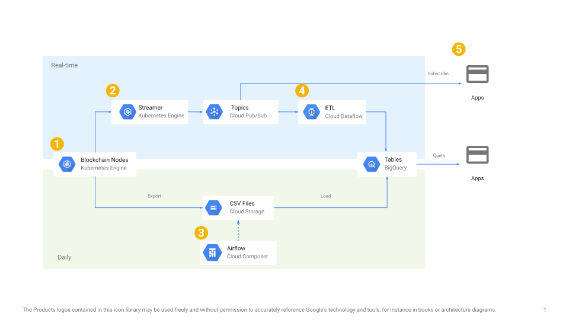

# Blockchain ETL Architecture

[Google Slides version](https://docs.google.com/presentation/d/1ZMTpj_1YKBxSBwvh2Y_0P-GRkHO-KR1mXZi9vyJWvg8/edit?usp=sharing)

1. The nodes are deployed with Terraform and run in Kubernetes. 
  Refer to these for more details:
    - Template repository for deploying Terraform configurations: https://github.com/blockchain-etl/blockchain-terraform-deployment
    - Terraform configuration files for running blockchain nodes: https://github.com/blockchain-etl/blockchain-terraform
    - Kubernetes manifests for running blockchain nodes: https://github.com/blockchain-etl/blockchain-kubernetes

2. The blockchain data is polled periodically from the nodes and pushed to Google Pub/Sub. 
  Refer to these for more details:
    - Article explaining how to subscribe to public blockchain data in Pub/Sub: 
  https://medium.com/google-cloud/live-ethereum-and-bitcoin-data-in-google-bigquery-and-pub-sub-765b71cd57b5 
    - Streaming blockchain data to Google Pub/Sub or Postgres in Kubernetes: 
  https://github.com/blockchain-etl/blockchain-etl-streaming
    - CLI tools for polling blockchain data from nodes: 
  https://github.com/blockchain-etl/ethereum-etl, 
  https://github.com/blockchain-etl/bitcoin-etl, 
  https://github.com/blockchain-etl/eos-etl.

3. Airflow DAGs export and load blockchain data to BigQuery daily. 
  Refer to these for more details:
    - Article explaining how the DAGs work: 
  https://cloud.google.com/blog/products/data-analytics/ethereum-bigquery-how-we-built-dataset.
    - Airflow DAGs for exporting, loading, and parsing blockchain data: 
  https://github.com/blockchain-etl/ethereum-etl-airflow, 
  https://github.com/blockchain-etl/bitcoin-etl-airflow, 
  https://github.com/blockchain-etl/eos-etl-airflow.
  
4. The blockchain data is pulled from Pub/Sub, transformed and streamed to BigQuery.
  Refer to these for more details:
    - Dataflow pipelines for connecting Pub/Sub topics with BigQuery tables: 
  https://github.com/blockchain-etl/blockchain-etl-dataflow.
  
5. Various applications of the public blockchain data:
    - Blockchain streaming analytics: https://github.com/blockchain-etl/blockchain-streaming-analytics.
    - Parsing Ethereum smart contract data: https://towardsdatascience.com/how-to-get-any-ethereum-smart-contract-into-bigquery-in-8-mins-bab5db1fdeee.
    - Blockchain analytics in BigQuery: https://github.com/blockchain-etl/awesome-bigquery-views.
    - Clustering Ethereum addresses: https://towardsdatascience.com/clustering-ethereum-addresses-18aeca61919d.
    - ...
  